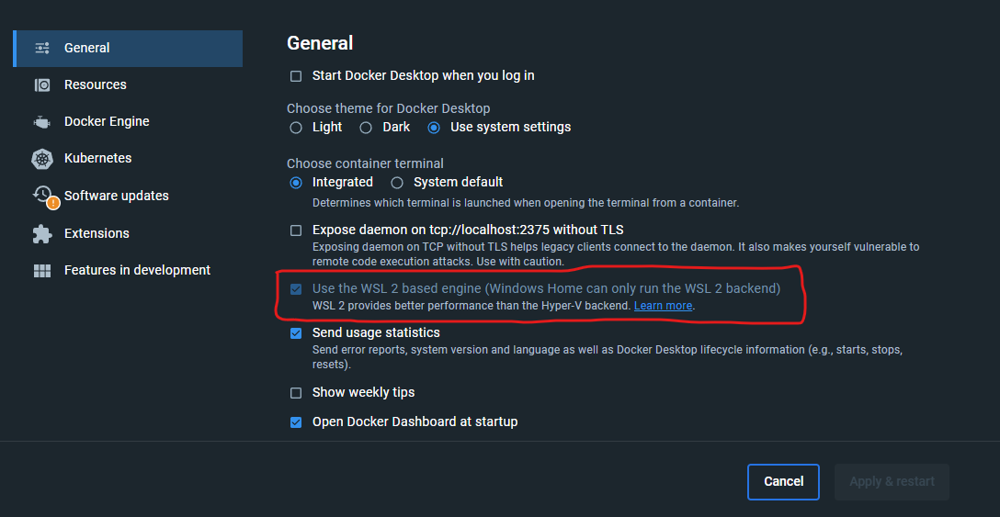

# STVGoDigital workshop
 Este workshop tem como principal objetivo mostrar o ambiente de desenvolvimento (tudo o que é necessário), bem como, como fazer alterações e disponibilizar as mesmas.

### Hyperledger Fabric

O Hyperledger Fabric é uma plataforma de blockchain open source, desenvolvida pela Linux Foundation em que se destaca no contexto de aplicações empresariais. 

https://hyperledger-fabric.readthedocs.io/en/release-2.5/

https://www.youtube.com/watch?v=1ORrdusUzeg

### Fablo

FABLO é uma ferramenta simples para gerar a rede blockchain Hyperledger Fabric e executá-la no Docker.

https://github.com/hyperledger-labs/fablo/blob/main/README.md

### Fablo REST

Uma interface simples da API REST para a rede blockchain Hyperledger Fabric.

- enroll, reenroll, register and list identities,
- discover the network for a given channel,
- query and invoke chaincode (with transient parameters support).

https://github.com/fablo-io/fablo-rest


# Pré-requisitos

## Source code

### original branch @lcvalves

https://github.com/lcvalves/stvgd-chaincode/tree/dev

### forked branch @marcelowolfsmartindustries
https://github.com/marcelowolfsmartindustries/stvgd-chaincode/tree/dev-ipvc

### Estrutura do projeto

```
📦stvgd-chaincode
 ┣ 📂docs --> documentação do projeto
 ┣ 📂pkg
 ┃ ┣ 📂app --> Chaincode (CRUD)
 ┃ ┃ ┣ 📜batch_tx.go
 ┃ ┃ ┣ 📜production_tx.go
 ┃ ┃ ┣ 📜reception_tx.go
 ┃ ┃ ┣ 📜registration_tx.go
 ┃ ┃ ┣ 📜transport_tx.go
 ┃ ┃ ┗ 📜utils.go
 ┃ ┗ 📂domain --> Entidades de domínio
 ┃ ┃ ┣ 📜batch.go
 ┃ ┃ ┣ 📜production.go
 ┃ ┃ ┣ 📜reception.go
 ┃ ┃ ┣ 📜registration.go
 ┃ ┃ ┗ 📜transport.go
 ┣ 📂test --> Testes
 ┣ 📂transaction_data --> Exemplo transação
 ┣ 📂vendor -->  Packages instalados
 ┣ 📜fablo-config-schema.json
 ┣ 📜fablo-config.json --> Configuração do fablo
 ┣ 📜fablo.sh
 ┣ 📜go.mod -> Dependencias
 ┣ 📜go.sum -> Dependencias
 ┣ 📜main.go -> Identificação do package 
```

## Ambiente de desenvolvimento & Software

O software a instalar deve ser instalado no SO do ambiente de desenvolvimento:

- Sistema operativo baseado em **Unix**:
  - **Linux** / **macOS**, etc...
   > ⚠️ Utilizadores Windows podem utilizar (preferencialmente) o **[WSL](https://docs.microsoft.com/en-us/windows/wsl/install)** ou máquinas virtuais como **VirtualBox**, **VMware** ou **Hyper-V** em conjunto com uma distribuição **Linux (ex: [Ubuntu LTS](https://ubuntu.com/wsl))**

- **[Fabric Development Environment Setup](https://hyperledger-fabric.readthedocs.io/en/release-2.2/dev-setup/devenv.html#prerequisites)**

  - **[Git](https://git-scm.com/downloads)**
  - **[GitHub Desktop](https://desktop.github.com/)**
  - **[Go](https://go.dev/dl/)**
  - **[Docker Desktop](https://docs.docker.com/get-docker/)**
  - **[Xcode Command Line Tools](https://idmsa.apple.com/IDMSWebAuth/signin.html?path=%2Fdownload%2Fall%2F&appIdKey=891bd3417a7776362562d2197f89480a8547b108fd934911bcbea0110d07f757&rv=0)** (macOS)
  - **[SoftHSM](https://github.com/opendnssec/SoftHSMv2)**
  - **[jq](https://stedolan.github.io/jq/download/)**

- **[Fabric Prerequisites](https://hyperledger-fabric.readthedocs.io/en/release-2.2/prereqs.html#prerequisites)**

- **[Visual Studio Code](https://code.visualstudio.com/Download) + Extensões ⬇️**:
  - **[*Go*](https://marketplace.visualstudio.com/items?itemName=golang.go)**
  - **[*Remote Development*](https://marketplace.visualstudio.com/items?itemName=ms-vscode-remote.vscode-remote-extensionpack)**


# Tutorial

1.  Abrir o VSCode
2.  Connect to WSL using distro
    ```
    Ubuntu-20.04
    ```
3.  No terminal do VSCode executar
    ```bash
    sudo apt-get update
    ```
    ```bash
    sudo apt install jq
    ```

4.  Mapear o projeto através do GitHub Desktop
    ```bash
    \\wsl.localhost\Ubuntu-20.04\home\{{user}}\go\src\github.com\marcelowolfsmartindustries\stvgd-chaincode
    ```

5.  Abrir o projeto mapeado


6. Instalar o GO
    ```bash
    cd ~
    sudo rm -rf /usr/local/go
    wget https://go.dev/dl/go1.21.4.linux-amd64.tar.gz
    sudo tar -C /usr/local -xzf go1.21.4.linux-amd64.tar.gz
    export PATH=$PATH:/usr/local/go/bin

    go install golang.org/x/tools/gopls@latest
    ```

7.  Instalar o fablo (raiz do projeto)
    ```bash
    sudo curl -Lf https://github.com/hyperledger-labs/fablo/releases/download/1.2.0/fablo.sh -o /usr/local/bin/fablo && sudo chmod +x /usr/local/bin/fablo
    ```

8.  Create vendor directory 
    ```bash
    go mod vendor
    ```

9.  Abrir o docker

10.  Permissão no docker


11. Gerar a network (1ª vez)
    ```bash
    fablo generate
    ```
    Depois da network gerada
    ```bash
    fablo start
    ```

12. Abrir o postman e importar o ficheiro em:
    ```
    ./docs/postman/Fablo REST.postman_collection.json
    ```

13. Testar ✅

## New feature(s) / bug fixing / etc...

1. Alterar o código

2.  main.go
    ```golang
    func main() {
      ...
      chaincode.Info.Version = "17"
    }
    ```

3.  fablo-config.json
    ```json
        "chaincodes": [
          {
            "name": "stvgd-chaincode",
            "version": "17",
            "lang": "golang",
            "channel": "stvgd-channel",
            "directory": "."
          }
        ]
    ```

4. Depois de alterar (com a network a correr)
    ```bash
    fablo chaincodes upgrade stvgd-chaincode {{version}}
    ```
5.  Abrir o postman

4.  Testar ✅

## Troubleshooting
1.  Caso dê erro de permissões ao alterar ficheiros no projeto
    ```bash
    sudo chmod -R 777 stvgd-chaincode/
    ```
2.  Command 'go' not found
      ```bash
    cd ~
    sudo rm -rf /usr/local/go
    wget https://go.dev/dl/go1.21.4.linux-amd64.tar.gz
    sudo tar -C /usr/local -xzf go1.21.4.linux-amd64.tar.gz
    export PATH=$PATH:/usr/local/go/bin
    ```
    Escrever apenas go no terminal.
    ```bash
    Go is a tool for managing Go source code.
    Usage:
        go <command> [arguments]    
      ```

3.  Command 'jq' not found
    ```bash
    sudo apt-get update
    ```
    ```bash
    sudo apt install jq
    ```
    
    Escrever apenas jq no terminal
    ```bash
    jq - commandline JSON processor [version 1.6]
    ```

# fabo.config.json

https://github.com/hyperledger-labs/fablo/blob/main/README.md#fablo-config

# Changelog
Criado em: 04-12-2023 por lcvalves e marcelowolfsmartindustries 
